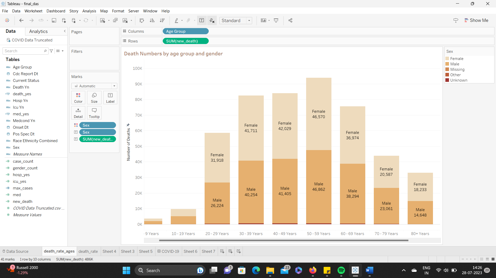

# Covid-19-Data-Analysis

## Death numbers by Age Group and Gender
 

In this figure we can observe that the most deaths occurred in the age group 50-59 years, and it can also be deduced that the most affected people are mostly males. Age groups 30-39 and 40-49 have similar death numbers, even when closely inspected in the case of gender there isn’t much difference. The most number of female deaths compared to males can be seen in the age group 20-29. The design principle used here is Similarity, grouping ages groups and genders together to give an easier perspective on the statistics. Used colors to differentiate the genders and other categories. 
Death Numbers by Race

 
This table above gives a basic idea of how the deaths are distributed by Race.  The highest number of deaths recorded are from an unknown race/ race that couldn’t be identified with 174,510 and White, Non-Hispanic follows it with 112, 682. The least deaths that occurred from a particular race is Native Hawaiian/Other Pacific Islander, Non-Hispanic with 868 deaths. It is important for the surveyors or any other data procurers to identify the unknown race, and give related information to certain individuals or organizations to make decisions that affect the lives of people in case a similar cataclysm strikes in future. The design principle used here is Enclosure as we are grouping all the races together. 

## Death numbers of people who have prior medical conditions 
 

In this bar graph we can observe that people in the age group of 80+ years who are previously affected by some medical conditions are the ones that were prone to COVID-19 with the most deaths reaching 5500. It is something one can expect as most of the old people have lesser immunity and, in such cases, the respiratory disease has a higher rate of infecting them, the contrary can be said for people of younger age. 

## COVID-19 active cases trends and forecasted trends
 

This line chart gives an idea of the COVID-19 trends among the past few years, we can state the fact that there were a higher number of cases in the year 2020 and the number exponentially decreased from 344K to 28K in the previous year. The forecasted trend shows that there might be a possibility  of the pandemic rising again in the next year.  Last time when COVID-19 showed up to the doorstep it was quite novel and somehow, we managed, now given the experience we should take required measures to stop this rise. The design principle used here is Continuity as the trend is represented by the line representing numbers over the years. 

## Single value charts. 

 

 

 

The single value charts give the stats of the year 2022, specifically the number hospitalized, number of people admitted to ICU and the most affected race. This design principle used here closure. 

## The Dashboard

From the dashboard we can observe that the number of COVID-19 cases have dropped exponentially kudos to the efforts of medical teams all over the world. But to reflect upon the past and derive insight from the areas where we lacked can help surpass another pandemic, if it ever occurs in the near future. We haven’t yet identified what the unknown races are, and other missing reports on this report. Special care should be given to people who are in the age groups of 50-59 and beyond as they have weaker immune systems, thus contracting the disease faster. Immune treatments must be provided from a young age to such races where the death toll is higher.  

